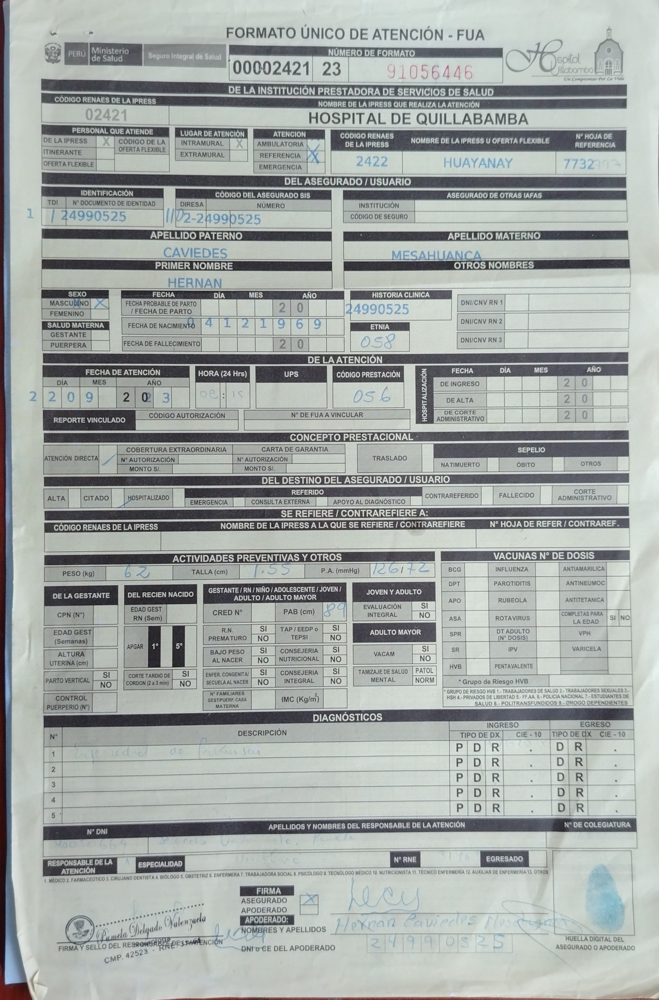
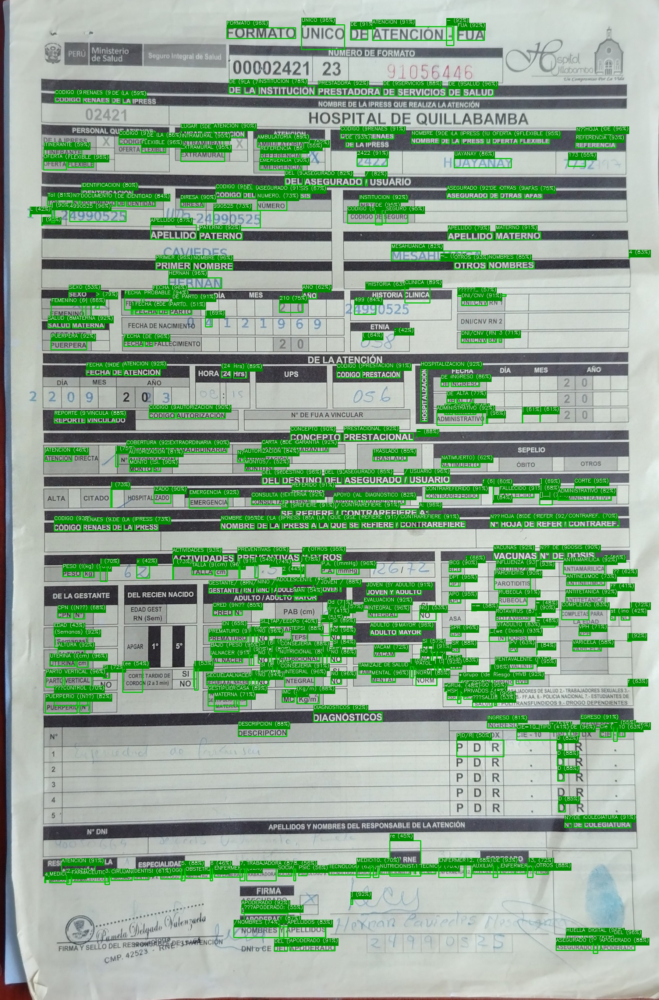

# Text Detection — FUA · Pytesseract

OCR pipeline that detects and annotates every word in scanned medical forms (**Formato Único de Atención — FUA**) using [Tesseract OCR](https://github.com/tesseract-ocr/tesseract), OpenCV, and Python. The tool draws green bounding boxes around each detected word together with its confidence score, and writes the annotated image to an output folder — all from a single Docker command.

---

## Visual Demo

| Input | Output |
|-------|--------|
|  |  |

> The output image highlights every recognised word with a green rectangle and a label showing the text and confidence percentage (e.g. `HOSPITAL (97%)`).

---

## Features

- **Batch processing** — processes every supported image found in `./input` in a single run.
- **Confidence filtering** — detections below 40 % confidence are discarded automatically.
- **Visual annotations** — green bounding boxes + dark-green labels with word text and confidence score overlaid on the original image.
- **Multi-language support** — ships with English (`eng`) and Portuguese (`por`) Tesseract language packs; easily extended to others.
- **Dockerised** — no local Tesseract installation required; one command builds and runs everything.
- **Supported formats** — `.png`, `.jpg`, `.jpeg`, `.bmp`, `.tiff`, `.tif`, `.webp`.

---

## Project Structure

```
text-detection-fua-pytesseract/
├── input/                         # Place source images here before running
│   └── FUA-YELLOW-VERTICAL.jpg    # Sample — scanned FUA medical form
├── output/                        # Annotated results are written here
│   └── FUA-YELLOW-VERTICAL_annotated.jpg
├── main.py                        # Core OCR + annotation logic
├── requirements.txt               # Python dependencies
├── Dockerfile                     # Container definition
├── docker-compose.yml             # Compose service (recommended entry point)
└── .dockerignore
```

---

## Requirements

| Requirement | Version |
|-------------|---------|
| Docker      | 20.10 + |
| Docker Compose | v2 + |

> No local Python or Tesseract installation is required when using Docker.

### Python dependencies (inside the container)

| Package | Version |
|---------|---------|
| `pytesseract` | 0.3.13 |
| `opencv-python-headless` | 4.10.0.84 |
| `Pillow` | 11.1.0 |
| `numpy` | 2.2.3 |

---

## Quick Start

### 1 — Clone the repository

```bash
git clone <repository-url>
cd text-detection-fua-pytesseract
```

### 2 — Add your images

Drop one or more images into the `input/` folder:

```bash
cp /path/to/your/scan.jpg input/
```

### 3 — Build and run

```bash
docker compose up --build
```

Annotated images appear in `output/` once the container exits.

---

## Running Without Docker Compose

```bash
# Build the image
docker build -t text-detection-ocr:latest .

# Run — mount local input/output directories
docker run --rm \
  -v "$(pwd)/input:/app/input" \
  -v "$(pwd)/output:/app/output" \
  text-detection-ocr:latest
```

---

## Configuration

The following parameters can be adjusted directly in `main.py`:

| Constant | Default | Description |
|----------|---------|-------------|
| `MIN_CONF` | `40` | Minimum Tesseract confidence (0–100) to draw a box |
| `BOX_COLOR` | `(0, 200, 0)` | Bounding-box colour in BGR |
| `BOX_THICKNESS` | `2` | Bounding-box line thickness in pixels |
| `FONT_SCALE` | `0.45` | Label font size |

### Changing the OCR language

Edit the `TESSERACT_LANG` environment variable in `docker-compose.yml`:

```yaml
environment:
  TESSERACT_LANG: por   # e.g. por (Portuguese), spa (Spanish), fra (French)
```

To add a language pack, extend the `apt-get install` step in the `Dockerfile`:

```dockerfile
RUN apt-get update && apt-get install -y --no-install-recommends \
        tesseract-ocr \
        tesseract-ocr-eng \
        tesseract-ocr-por \
        tesseract-ocr-spa \   # ← add new language here
        ...
```

---

## How It Works

```
Input image
    │
    ▼
PIL / Pillow  ──────────────────────────  load & convert to RGB
    │
    ▼
pytesseract.image_to_data()  ───────────  run Tesseract, get word boxes + confidence
    │
    ▼
Filter (conf ≥ MIN_CONF, non-empty text)
    │
    ▼
OpenCV  ────────────────────────────────  draw rectangle + labelled overlay per word
    │
    ▼
cv2.imwrite()  ─────────────────────────  save to output/<stem>_annotated.<ext>
```

1. Each image is opened with Pillow and converted to RGB for consistent Tesseract input.
2. `pytesseract.image_to_data` returns a dictionary with bounding-box coordinates, recognised text, and confidence scores for every detected word.
3. Words with confidence ≥ 40 % are drawn onto the image using OpenCV — a green rectangle marks the word boundary and a dark-green label above it shows `word (conf%)`.
4. The annotated image is saved to `output/` preserving the original file extension.

---

## Example Output Log

```
2026-03-13 10:00:01 [INFO] Found 1 image(s) to process.
2026-03-13 10:00:01 [INFO] Processing: FUA-YELLOW-VERTICAL.jpg
2026-03-13 10:00:04 [INFO]   FUA-YELLOW-VERTICAL.jpg → 312 word(s) annotated
2026-03-13 10:00:04 [INFO]   Saved → /app/output/FUA-YELLOW-VERTICAL_annotated.jpg
2026-03-13 10:00:04 [INFO] Done. Results are in /app/output
```

---

## License

This project is released under the [MIT License](LICENSE).
